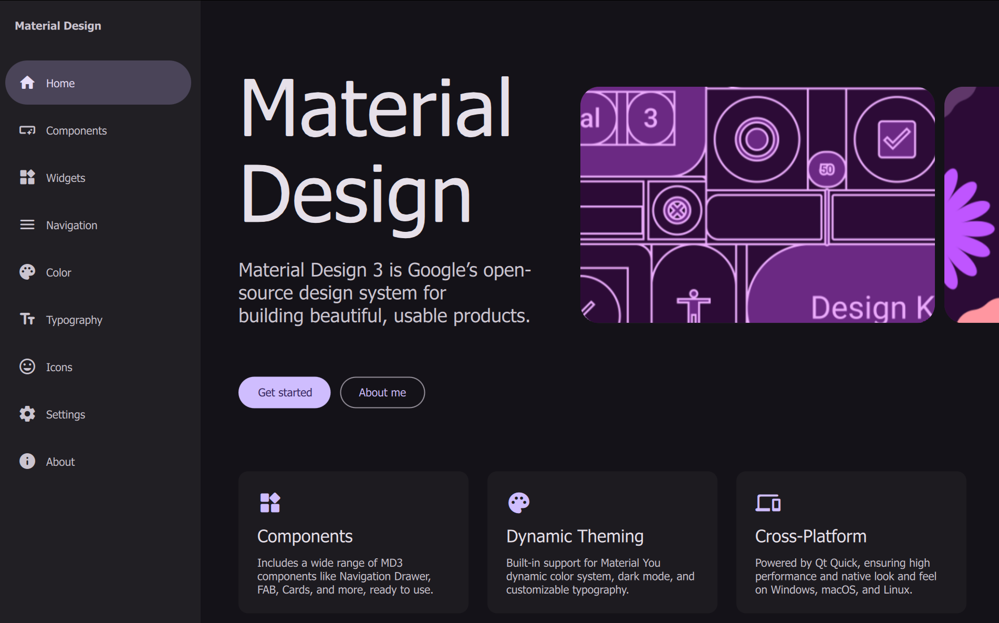
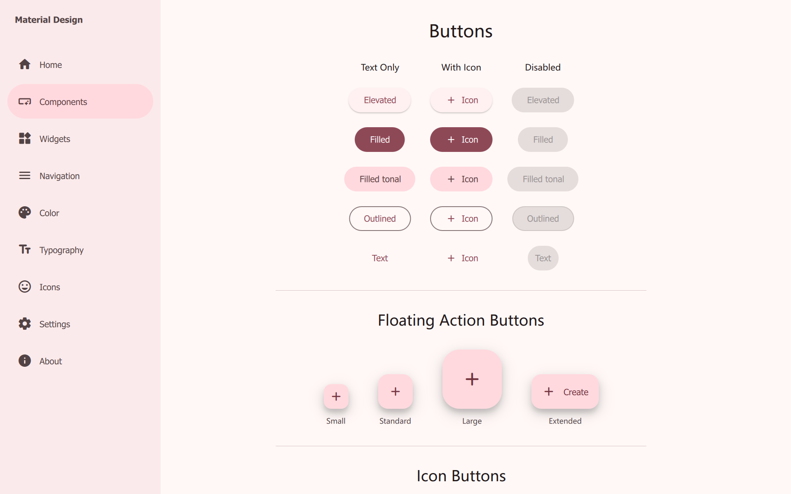
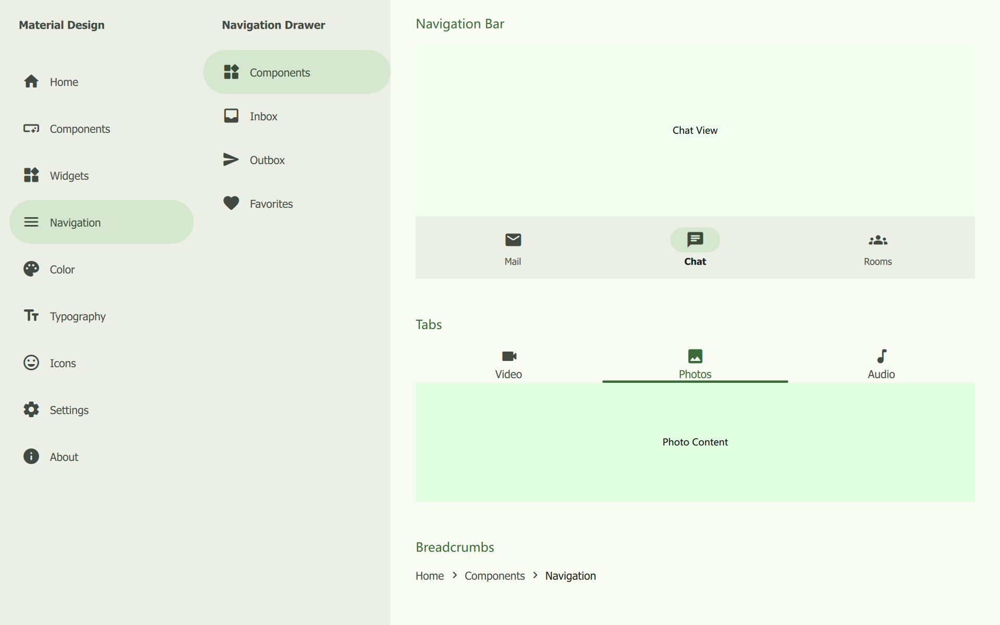
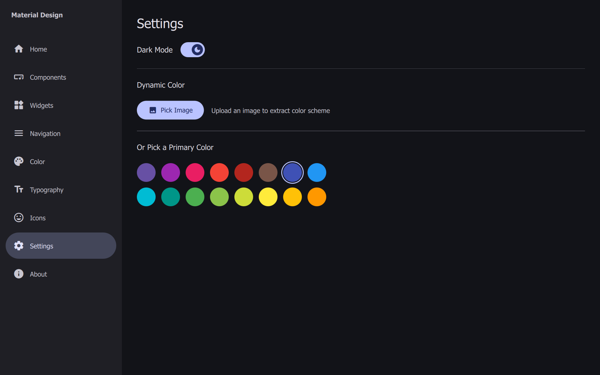
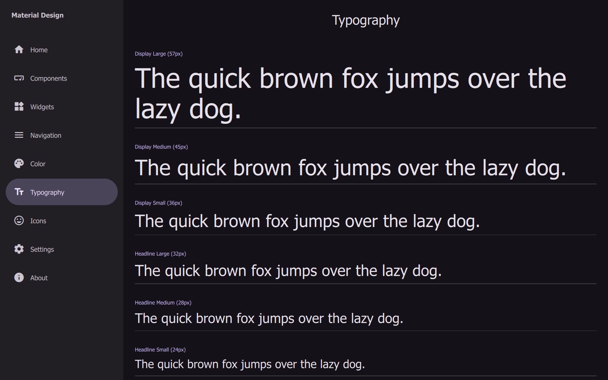
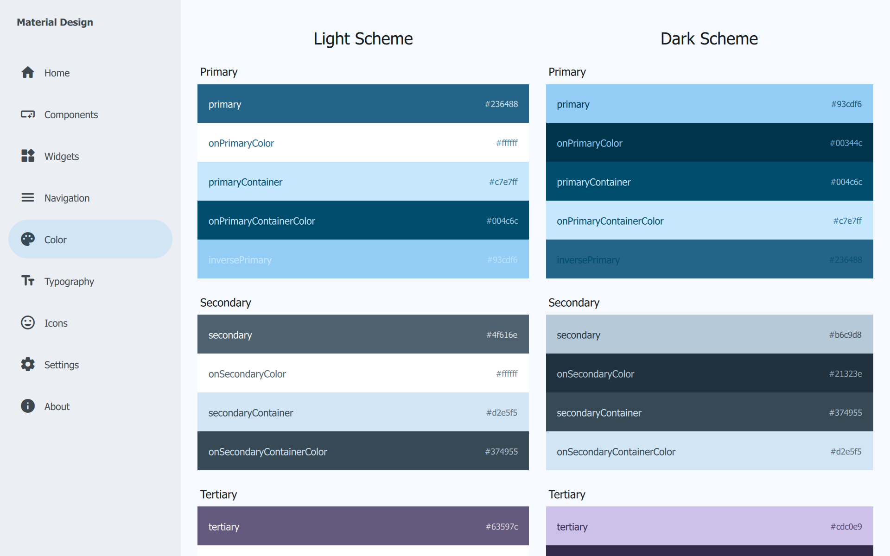

# Material Design 3 for Qt Quick (QML)

<p align="center">
  
</p>

This project implements **Material Design 3 (Material You)** components using Qt Quick (QML) and C++. It aims to provide a comprehensive set of UI components that follow the latest Google Material Design guidelines, complete with dynamic color support and adaptive layouts.

## Preview

<table align="center">
  <tr>
    <td></td>
    <td></td>
  </tr>
  <tr>
    <td></td>
    <td></td>
  </tr>
  <tr>
    <td></td>
    <td></td>
  </tr>
</table>

## Features

- **Material Design 3 Components**: A wide range of reusable QML components styled according to MD3 specifications.
- **Dynamic Color System**: Integrated with `material-color-utilities` (C++) to support dynamic color generation from seed colors.
- **Theming**: Centralized `Theme` singleton for easy customization of typography, colors, and shapes.
- **Cross-Platform**: Built with Qt 6, supporting Windows, macOS, Linux, Android, and iOS.

## Available Components

The following components are currently implemented in `components/`:

- **Actions**: `Button`, `IconButton`, `FAB`, `SegmentedButton`
- **Navigation**: `NavigationDrawer`, `NavigationBar`, `Tabs`, `Breadcrumb`
- **Inputs**: `TextField`, `Checkbox`, `RadioButton`, `Switch`, `Slider`, `RangeSlider`, `ComboBox`
- **Containment**: `Card`, `Dialog`, `SideSheet`, `Menu`, `Carousel`
- **Feedback & Status**: `CircularProgress`, `LinearProgress`, `LoadingIndicator`, `ToolTip`, `Chip`
- **Utils**: `Ripple`, `DatePicker`, `TimePicker`

## Prerequisites

- **Qt 6.8** or higher (Required for latest QML features)
- **CMake** 3.16+
- **C++ Compiler** (supporting C++17 or higher)

## Build & Run

1.  **Clone the repository**:
    ```bash
    git clone https://github.com/your-username/material-components-qml.git
    cd material-components-qml/md3
    ```

2.  **Configure with CMake**:
    ```bash
    mkdir build
    cd build
    cmake ..
    ```

3.  **Build**:
    ```bash
    cmake --build .
    ```

4.  **Run**:
    - On Windows: `Debug\appmd3.exe` or `Release\appmd3.exe`
    - On Linux/macOS: `./appmd3`

## Project Structure

```
md3/
├── assets/             # Icons and font resources
├── components/         # Reusable MD3 QML components
├── material-color-utilities/ # Google's Material Color C++ library
├── pages/              # Example pages demonstrating components
├── widgets/            # Future widget implementations
├── Main.qml            # Application entry point
├── Theme.qml           # Singleton defining global styles (Colors, Typography)
├── main.cpp            # C++ entry point and backend integration
└── CMakeLists.txt      # Build configuration
```

## License

This project is licensed under the LGPL v3 License - see the [LICENSE](LICENSE) file for details.
# Material-Design-3-for-Qt-Quick-QML-
